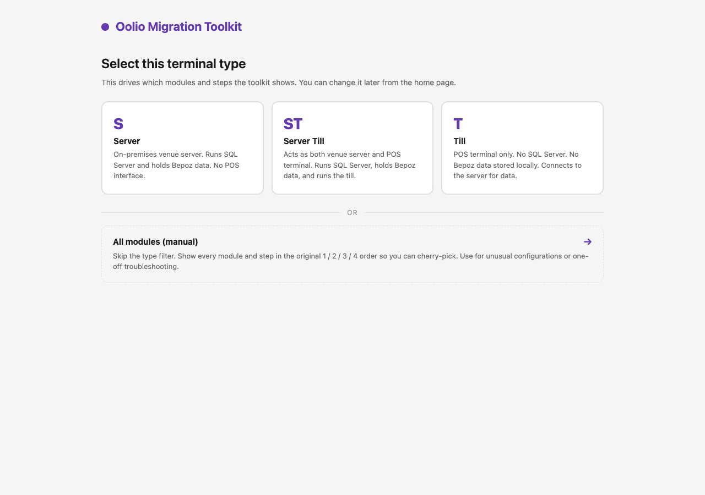
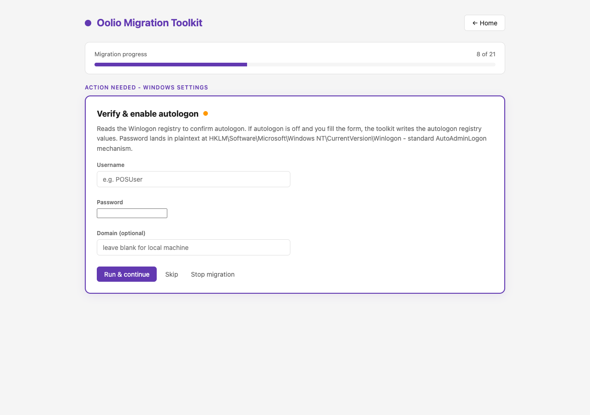
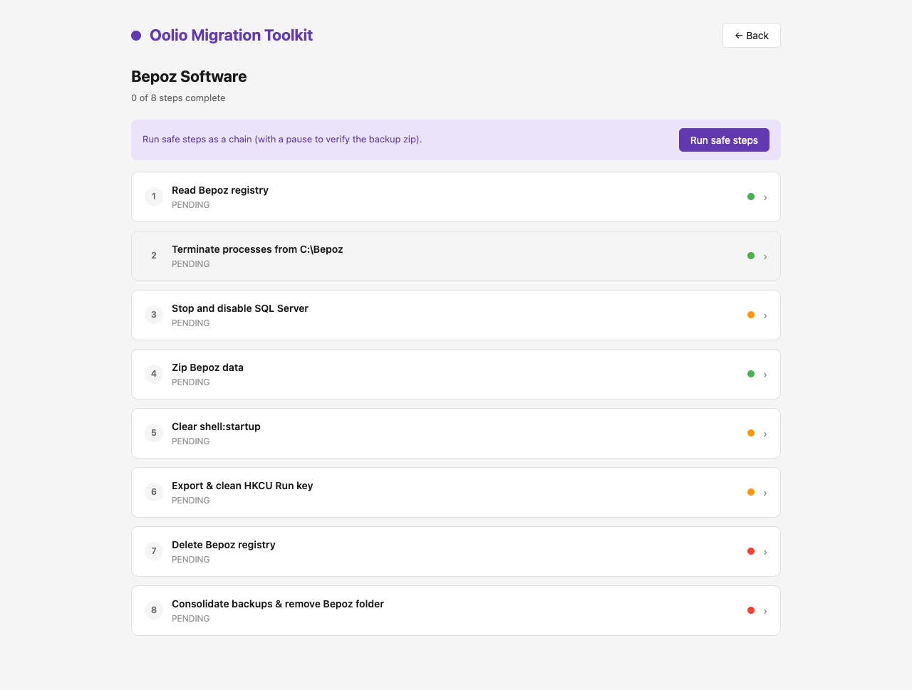
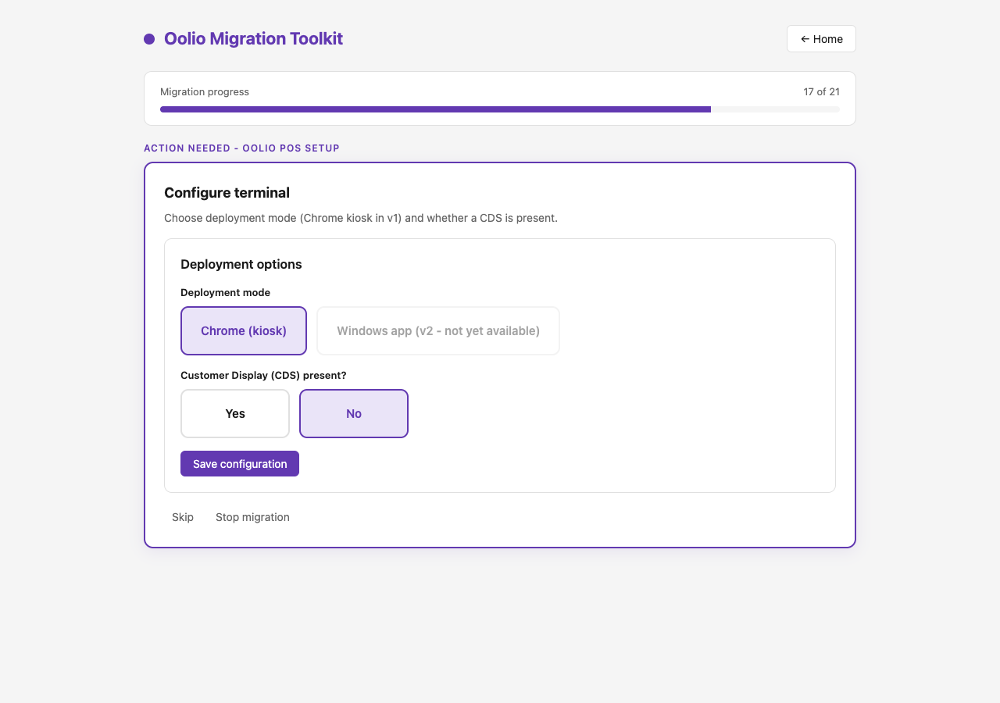

# Oolio Migration Toolkit

A locally-hosted web toolkit that guides a technician through migrating a Windows POS terminal from Bepoz to the Oolio Platform.

## Usage

### Option A — Remote (ScreenConnect / elevated PowerShell)

Paste this one-liner into an elevated ScreenConnect command (or any admin PowerShell on the terminal). It pulls the latest release, extracts it to `C:\OolioMigration\`, and launches:

```powershell
iwr https://raw.githubusercontent.com/StephenShawBepoz/oolio-migration-toolkit/main/bootstrap.ps1 -UseBasicParsing | iex
```

### Option B — Manual (USB stick or pre-staged copy)

1. Download the latest release zip from the [Releases page](https://github.com/StephenShawBepoz/oolio-migration-toolkit/releases/latest).
2. Extract `OolioMigration\` to the terminal (e.g. `C:\OolioMigration\`).
3. (Optional) Replace `assets\wallpaper.jpg` with a different image if needed.
4. Right-click `Launch.ps1` and choose **Run as Administrator**.
5. The browser opens to `http://localhost:8080` with the technician UI (falls back to 8081–8084 if 8080 is taken).

Works on Windows 10 and Windows 11. Chrome, WebView2, and TeamViewer are auto-installed at run-time if missing (needs internet at those steps). The rest of the toolkit runs fully offline once unpacked.

## Screenshots

| Select terminal type | Guided migrate flow |
|---|---|
|  |  |

| Module view | Deployment options |
|---|---|
|  |  |

## Folder structure

```
OolioMigration\
  Launch.ps1            entry point
  bootstrap.ps1         remote one-liner bootstrapper (ScreenConnect)
  progress.json         auto-created, persists state
  server\               HTTP listener + router
  ui\                   single-page web app
  scripts\              module + shared PowerShell logic
  assets\               wallpaper.jpg ships here
  installers\           drop POS-*-installer.exe here (not shipped, not in git)
  tools\                standalone diagnostics (Internet-Check)
```

See `OVERVIEW.md` for how the toolkit works and `CHANGELOG.md` for release history. (`claude.md` is the original v1 design spec, kept for reference.)
